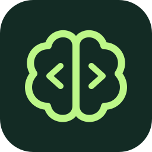

# VibeWise Science

**You do the science. AI writes the code.**

A Claude Code plugin for learning to write research code in psychology, NeuroAI,
and machine learning. Before writing code, Claude asks how you'd approach the
analysis and teaches the methods that fit: when to use each one, what it assumes,
what the alternatives are, and what can go wrong. You choose. Claude writes the code
with brief explanations, then reports how the result was checked, and asks you to
interpret it before giving its own reading.

> **Credit:** The basic idea and the original code come from
> [VibeWise](https://github.com/nykooi1/vibe-wise) by Noah Kim. VibeWise Science
> is a fork maintained by Jakob Winkler. It keeps VibeWise's reasoning-first loop,
> hook, and reset helper, and shifts the teaching from software design to
> scientific methods.

## What's different from VibeWise

| | VibeWise | VibeWise Science |
| --- | --- | --- |
| Focus | Software design: components, data, stack | Methods: assumptions, alternatives, caveats, validation |
| Choosing an approach | You propose; options only when you ask | You reason about the data; Claude lays out candidate methods; you choose and justify |
| Code explanations | Full | Brief by default, except code that can change results |
| After results | Implementation report | Report that separates code tests from analysis validation, then an Interpretation checkpoint |
| Notes folder | `.vibe-wise/` | `.vibe-wise-science/` (the two plugins never share notes) |

## Get started

You need [Claude Code](https://code.claude.com/docs/en/setup) and
[Python 3](https://www.python.org/downloads/). No extra Python packages are needed.
On Windows, Claude Code runs the plugin's hook in Git Bash; if `python3` is only the
Microsoft Store alias, the hook falls back to `python`.

Run these commands **one at a time** in Claude Code. First, add the marketplace:

```text
/plugin marketplace add MLGandi/vibe-wise-science
```

After it finishes, install the plugin:

```text
/plugin install vibe-wise-science@vibe-wise-science
```

**Enable automatic updates:** open `/plugin` → **Marketplaces** →
**vibe-wise-science** → **Enable auto-update**. This is off by default for
third-party marketplaces.

To work on the plugin itself, clone the repository and either add the local folder
as the marketplace (`/plugin marketplace add C:/path/to/vibe-wise-science`) or start
Claude Code with `claude --plugin-dir C:/path/to/vibe-wise-science`.

Restart Claude Code in the project you want to work on, then run:

```text
/vibe-wise-science:learn
```

Setup asks one question at a time: what you're doing (new project, existing repo,
known project, or reproducing a paper), your field, your methods background, your
programming experience, and your preferences. Pick **Use defaults** to skip
preference setup.

## What it feels like

You have Stroop data and want to know whether people respond more slowly when the
word and ink color conflict. This condensed example is illustrative, not a
transcript; Claude's wording and question order will vary.

**You:**

```text
40 participants, about 100 trials each, half congruent and half incongruent.
I want to test whether people are slower on incongruent trials.
```

**Claude:**

> **✦ Build checkpoint: Structure of the data**
>
> Before picking a test: which observations in this dataset can you treat as
> independent of each other, and which can't you?

**You:**

```text
Trials from the same person aren't independent; some people are just slower.
Different participants are independent.
```

**Claude:**

> Right: trials are nested in participants, and everyone sees both conditions, so
> the comparison is within-subject.
>
> **✦ Method checkpoint: Comparing conditions within participants**
>
> | Method | When it fits | Key assumptions | Caveats |
> | --- | --- | --- | --- |
> | Paired t-test on participant means | Balanced within-subject design, one contrast | Differences in condition means roughly normal | Discards trial-level variability; hides unequal trial counts after exclusions |
> | Wilcoxon signed-rank test | Same design, skewed or outlier-prone differences | Differences symmetric around their center | Tests a different quantity than the mean difference; less power when normality holds |
> | Linear mixed-effects model on trials | Trial-level data, unequal trial counts, stimulus effects | Roughly normal residuals; sensible random-effects structure | Raw RTs are right-skewed; random slopes can fail to converge |
>
> Which would you choose here, and what about your data makes it fit?

**You:**

```text
The mixed model: everyone has a different baseline speed and I want to keep the
trials. But you said RTs are skewed. Does that break it?
```

**Claude:**

> **✦ Assumptions: Reaction-time distributions**
>
> A linear mixed model assumes roughly normal residuals, and raw RTs have a long
> right tail. Common options are modeling log RT or using a generalized mixed model
> with a skewed distribution. The choice changes what the effect means: on the log
> scale it is a ratio ("9% slower") rather than milliseconds.
>
> Which scale do you want the effect on, and why?

**You:**

```text
Log RT. Slower people probably also have bigger Stroop effects in milliseconds,
so a ratio compares people more fairly.
```

**Claude:**

> That's an argument about scale, not just a fix for skew: a proportional effect
> looks the same for fast and slow participants on the log scale.
>
> **✦ Design checkpoint: Stroop analysis plan**
>
> Proposed: a linear mixed model of log RT with condition as a fixed effect and
> by-participant random intercepts and slopes for condition. Check residuals, and
> validate by simulating data with a known effect to confirm the model recovers it.
> Exclusions and error trials are still open.
>
> ```text
> ❯ 1. Confirm and continue
>      This approach makes sense to me; move to the next piece.
>   2. Discuss
>      Ask questions or clarify anything that doesn't make sense before deciding.
> ```

*Later, after exclusions are agreed and you choose **Implement this step**...*

**Claude:**

> **✦ Implementation report: Stroop mixed model**
>
> - `analysis/fit_model.py` fits the agreed model; trials are excluded by the agreed rules before log-transforming.
> - Code test: on a three-participant fixture, exclusions and the model formula produce the expected rows. Passed.
> - Analysis validation: on 40 simulated participants with a planted 8% slowdown, the model recovered the effect within its confidence interval. Residual plot saved for review.
> - Not yet done: fitting the real data and interpreting the estimate.

> **✦ Interpretation checkpoint: The Stroop effect**
>
> The model estimates incongruent trials are about 9% slower. What does this result
> tell you, and what doesn't it?

You don't need to know the answer already. Claude explains unfamiliar methods
directly, and when you don't know which methods exist, it shows you the landscape
instead of asking you to guess. Answer in plain English; ask for a recommendation
or say “skip” whenever you want.

| Checkpoint | What happens |
| --- | --- |
| **Build** | You reason through the question, the measures, and the structure of the data. |
| **Method** | After you describe the problem, Claude compares candidate methods: when each fits, its assumptions, and its caveats. You choose and justify. |
| **Design** | Review the analysis plan. **Confirm and continue** records it; no code yet. |
| **Implementation** | Review the specific code changes. **Implement this step** authorizes Claude to make them. |
| **Interpretation** | Once results exist, you say what they show and don't show before Claude gives its reading. |

These aren't mandatory stops. When ready to code, the Implementation checkpoint also
confirms the design, skipping a separate Design checkpoint. Both confirmations offer
**Discuss** to ask questions or explore alternatives before deciding.

Along the way, Claude uses short callouts: **Concept** (what something is),
**Why this matters** (its consequences here), **Assumptions** (what must hold and
how to check it), and **Caveats** (pitfalls and common misreadings).

Code stays brief, with one exception: code that can change results is treated as a
scientific decision and gets a checkpoint. That covers data splits and leakage,
preprocessing order, seeds, exclusions, convergence settings, hyperparameter search,
and library defaults that silently change a method.

## Make it yours

Methods background and programming experience are set separately, so you can be
an advanced coder learning statistics, or the reverse:

| Level | Teaching approach |
| --- | --- |
| Beginner | Explain unfamiliar methods, use diagrams, ask smaller reasoning questions. |
| Intermediate | Less introductory context; explore how choices interact. |
| Advanced | Probe assumptions, failure modes, and edge cases. |

Checkpoint frequency (Light, Normal, or Frequent) and code explanations (Brief,
Standard, or Detailed) are separate settings. You can also just say:

- “Show me the alternatives for this step.”
- “Recommend a method.”
- “Explain this code in detail.”
- “Use fewer checkpoints.”
- “Just implement this one.”
- “Pause learning.” Resume with `/vibe-wise-science:learn`.

Preferences, learning notes, and a project map live in `.vibe-wise-science/` in
your project. The map tracks the research question, data structure, pipeline,
methods, assumptions, validation, and reproducibility. Learning mode resumes in
future sessions and after compaction. Add `.vibe-wise-science/` to your `.gitignore`
to keep your notes out of Git; the plugin won't change it silently.

Psychology and neuroscience data often describe people. VibeWise Science tells
Claude to inspect data structure (columns, shapes, counts, summaries) rather than
participant-level records, and never to copy such data into notes. These are
instructions to Claude, not technical restrictions: your normal Claude Code
permissions and data settings still apply. There's no extra account, backend, or telemetry.

To start learning this project from scratch, run `/vibe-wise-science:reset`. It
shows the project and asks **Cancel / Reset learning**. After confirmation, it backs
up your profile, progress, and project map inside the notes directory's `backups/`
folder, then restarts onboarding. Source code, data, and other projects stay
untouched. To change your levels or preferences, just tell Claude; no reset is needed.

## Updating

With auto-update enabled, Claude Code picks up new versions itself. To update
manually, run these in your terminal:

```sh
claude plugin marketplace update vibe-wise-science
claude plugin update vibe-wise-science@vibe-wise-science
```

Then restart Claude Code. Your project learning notes stay intact.
Run `claude plugin list` to check the installed version.

## License

[MIT](LICENSE). The original VibeWise idea and code are copyright Noah Kim; the
VibeWise Science modifications are copyright Jakob Winkler. You can use, modify,
and share this software, including commercially. Keep the license notice, with
both copyright lines, in copies. The software comes without a warranty.
